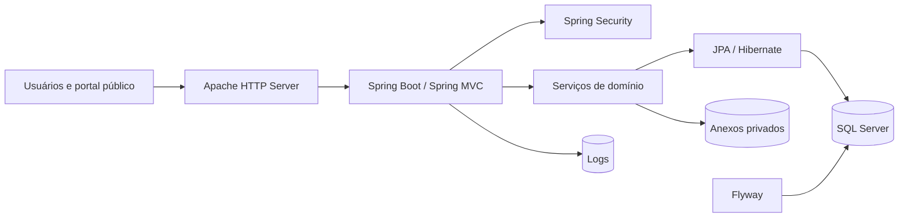
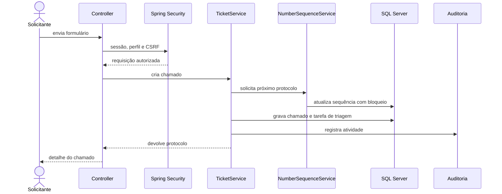

# Arquitetura

A Central de Serviços de TI é um monólito modular com renderização no servidor. A topologia abaixo representa a implantação suportada pelo projeto, sem endereços do ambiente real.

## Responsabilidades

| Componente | Responsabilidade |
|---|---|
| Apache | entrada HTTP, proxy reverso, headers e entrega da página de indisponibilidade |
| Spring Security | autenticação, sessão, CSRF, autorização de rotas e headers de segurança |
| Controllers | rotas, formulários e respostas HTML, JSON ou CSV |
| Services | transações, autorização de domínio, SLA, workflow, auditoria e armazenamento |
| Repositories e specifications | persistência JPA e filtros dinâmicos |
| SQL Server | dados transacionais, integridade referencial, índices e bloqueios necessários |
| Flyway | evolução versionada do esquema |
| Volumes | persistência de anexos e logs fora da imagem da aplicação |

## Fluxo de um chamado

## Decisões de implantação

- o Apache e a aplicação compartilham uma rede de entrada;
- aplicação e banco compartilham uma rede privada separada;
- o banco não precisa ser publicado para a rede quando roda no mesmo host;
- configurações variáveis ficam fora da imagem;
- reiniciar ou reconstruir containers não remove os volumes persistentes.

## Por que esta arquitetura é coerente

O sistema precisa ser instalável e mantido localmente. Um monólito modular reduz os pontos de falha, simplifica transações e facilita diagnóstico. Caso a carga ou os limites organizacionais mudem, os módulos de notificação, anexos e relatórios são candidatos naturais a extração — mas essa complexidade não foi antecipada sem necessidade medida.
