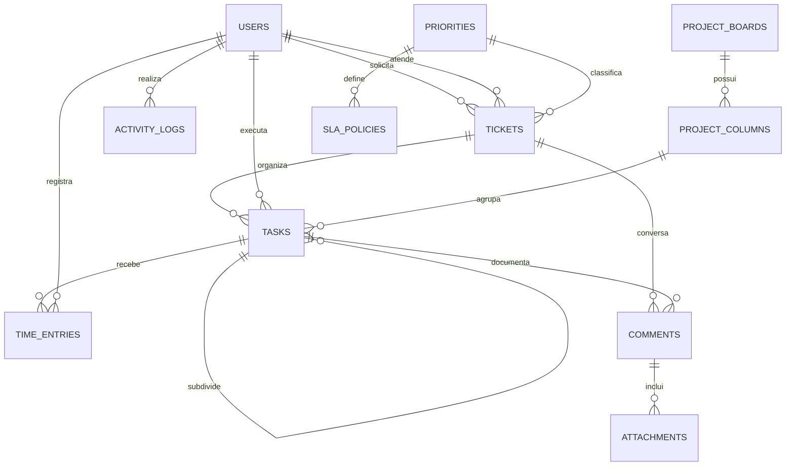

# Modelo de dados

O banco possui mais entidades do que cabem em um diagrama de apresentação. A visão abaixo mostra o núcleo transacional; catálogos, preferências e configurações foram omitidos para manter a leitura.

## Entidades centrais

| Entidade | Papel |
|---|---|
| `USERS` | identidade, perfil, estado da conta e vínculo organizacional |
| `TICKETS` | solicitação, responsável, estado, prazos, solução e dados de SLA |
| `TASKS` | execução técnica, hierarquia, responsável, cronômetro e posição em projeto |
| `TIME_ENTRIES` | tempo registrado por usuário e tarefa |
| `COMMENTS` | mensagens públicas ou internas ligadas a chamados e tarefas |
| `ATTACHMENTS` | metadados, localização privada e checksum do arquivo |
| `ACTIVITY_LOGS` | ação, campo alterado, valores anterior/novo e contexto da requisição |
| `PROJECT_BOARDS` / `PROJECT_COLUMNS` | organização visual das tarefas de projeto |
| `SLA_POLICIES` / `SLA_HOLIDAYS` | metas por prioridade e calendário não útil |
| `NUMBER_SEQUENCES` | numeração anual transacional de chamados e tarefas |

## Integridade observada

- chaves estrangeiras ligam usuários, chamados, tarefas, apontamentos e catálogos;
- checks de banco restringem estados e valores críticos;
- índices atendem filtros de dashboard, SLA, responsáveis e quadros;
- exclusão funcional é lógica para preservar histórico;
- `@Version` protege chamados e tarefas contra atualização concorrente silenciosa;
- a migration de quadros impede combinações inválidas entre quadro e coluna.

O diagrama é intencionalmente conceitual. Ele não expõe nomes de banco, dados ou topologia do ambiente de produção.
